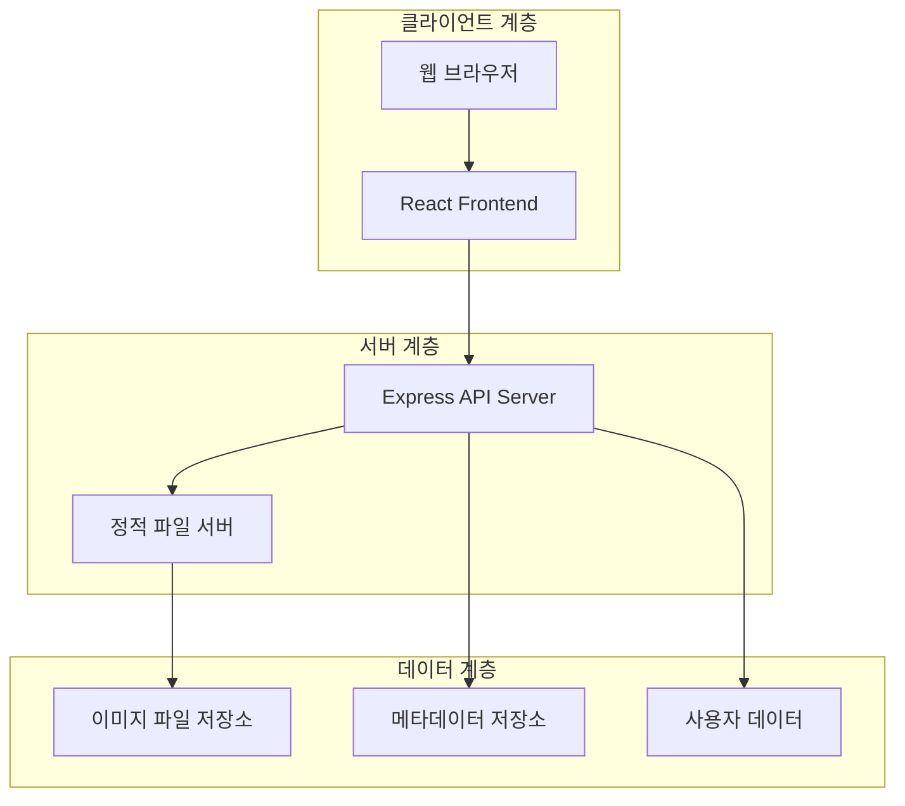

# 설계 문서 (Design Document)

## 개요 (Overview)

배경화면 다운로드 웹사이트는 모노레포 구조의 풀스택 웹 애플리케이션으로, Express.js 백엔드와 React 프론트엔드로 구성됩니다. 사용자는 테마별로 분류된 고품질 배경화면을 탐색하고, 원하는 해상도로 다운로드하며, 좋아요 기능을 통해 개인화된 경험을 할 수 있습니다.

시스템은 RESTful API 아키텍처를 따르며, 이미지 파일은 정적 파일로 서빙되고, 메타데이터는 JSON 파일 또는 경량 데이터베이스에 저장됩니다. 반응형 웹 디자인을 통해 다양한 디바이스에서 최적화된 사용자 경험을 제공합니다.

## 아키텍처 (Architecture)

### 전체 시스템 아키텍처



### 모노레포 구조

```
wallpaper-website/
├── packages/
│   ├── frontend/          # React 애플리케이션
│   │   ├── src/
│   │   ├── public/
│   │   └── package.json
│   └── backend/           # Express API 서버
│       ├── src/
│       ├── uploads/       # 이미지 파일 저장소
│       └── package.json
├── shared/                # 공통 타입 정의
├── package.json          # 루트 패키지 설정
└── lerna.json           # 모노레포 설정
```

## 컴포넌트 및 인터페이스 (Components and Interfaces)

### 백엔드 컴포넌트

#### API 라우터
- **WallpaperRouter**: 배경화면 관련 API 엔드포인트
- **ThemeRouter**: 테마 관리 API 엔드포인트  
- **UserRouter**: 사용자 좋아요 관리 API 엔드포인트

#### 서비스 계층
- **WallpaperService**: 배경화면 비즈니스 로직
- **ThemeService**: 테마 분류 및 관리 로직
- **UserPreferenceService**: 사용자 선호도 관리 로직
- **FileService**: 이미지 파일 처리 및 서빙 로직

#### 데이터 접근 계층
- **WallpaperRepository**: 배경화면 메타데이터 CRUD
- **ThemeRepository**: 테마 데이터 관리
- **UserRepository**: 사용자 좋아요 데이터 관리

### 프론트엔드 컴포넌트

#### 페이지 컴포넌트
- **HomePage**: 메인 페이지 (테마 목록 및 인기 배경화면)
- **ThemePage**: 특정 테마의 배경화면 목록
- **WallpaperDetailPage**: 배경화면 상세 보기 및 다운로드
- **FavoritesPage**: 사용자 좋아요 목록

#### UI 컴포넌트
- **WallpaperGrid**: 배경화면 그리드 레이아웃
- **WallpaperCard**: 개별 배경화면 카드
- **ThemeSelector**: 테마 선택 컴포넌트
- **SearchBar**: 검색 입력 컴포넌트
- **DownloadModal**: 해상도 선택 및 다운로드 모달
- **LikeButton**: 좋아요 버튼 컴포넌트

### API 인터페이스

#### REST API 엔드포인트

```typescript
// 배경화면 관련
GET /api/wallpapers              // 모든 배경화면 조회
GET /api/wallpapers/:id          // 특정 배경화면 조회
GET /api/wallpapers/theme/:theme // 테마별 배경화면 조회
GET /api/wallpapers/search       // 배경화면 검색

// 테마 관련
GET /api/themes                  // 모든 테마 조회
GET /api/themes/:id              // 특정 테마 조회

// 사용자 좋아요 관련
GET /api/users/:userId/likes     // 사용자 좋아요 목록
POST /api/users/:userId/likes    // 좋아요 추가
DELETE /api/users/:userId/likes/:wallpaperId // 좋아요 제거

// 파일 다운로드
GET /api/download/:id/:resolution // 특정 해상도 이미지 다운로드
```

## 데이터 모델 (Data Models)

### 배경화면 모델 (Wallpaper)

```typescript
interface Wallpaper {
  id: string;                    // 고유 식별자
  title: string;                 // 배경화면 제목
  description?: string;          // 설명
  themeId: string;              // 테마 ID
  tags: string[];               // 검색용 태그
  resolutions: Resolution[];     // 사용 가능한 해상도 목록
  thumbnailUrl: string;         // 썸네일 이미지 URL
  originalUrl: string;          // 원본 이미지 URL
  likeCount: number;            // 좋아요 수
  downloadCount: number;        // 다운로드 수
  createdAt: Date;              // 생성일
  updatedAt: Date;              // 수정일
}

interface Resolution {
  width: number;                // 가로 해상도
  height: number;               // 세로 해상도
  fileUrl: string;              // 해당 해상도 파일 URL
  fileSize: number;             // 파일 크기 (bytes)
}
```

### 테마 모델 (Theme)

```typescript
interface Theme {
  id: string;                   // 고유 식별자
  name: string;                 // 테마 이름
  description: string;          // 테마 설명
  iconUrl?: string;             // 테마 아이콘 URL
  wallpaperCount: number;       // 해당 테마의 배경화면 수
  isActive: boolean;            // 활성화 상태
  sortOrder: number;            // 정렬 순서
  createdAt: Date;              // 생성일
}
```

### 사용자 좋아요 모델 (UserLike)

```typescript
interface UserLike {
  id: string;                   // 고유 식별자
  userId: string;               // 사용자 ID (세션 기반)
  wallpaperId: string;          // 배경화면 ID
  likedAt: Date;                // 좋아요 표시 시간
}
```

### 검색 결과 모델 (SearchResult)

```typescript
interface SearchResult {
  wallpapers: Wallpaper[];      // 검색된 배경화면 목록
  totalCount: number;           // 전체 결과 수
  page: number;                 // 현재 페이지
  pageSize: number;             // 페이지 크기
  hasMore: boolean;             // 추가 결과 존재 여부
}
```
## 정확성 속성 (Correctness Properties)

*속성(Property)은 시스템의 모든 유효한 실행에서 참이어야 하는 특성이나 동작입니다. 본질적으로 시스템이 무엇을 해야 하는지에 대한 형식적 명세입니다. 속성은 사람이 읽을 수 있는 명세와 기계가 검증할 수 있는 정확성 보장 사이의 다리 역할을 합니다.*

### 속성 1: 테마별 배경화면 필터링
*모든* 테마에 대해, 해당 테마를 선택했을 때 반환되는 배경화면들은 모두 선택된 테마에 속해야 한다
**검증 대상: 요구사항 1.2**

### 속성 2: 배경화면 필수 정보 포함
*모든* 배경화면 데이터에 대해, 렌더링될 때 미리보기 이미지 URL과 기본 정보(제목, 테마)가 포함되어야 한다
**검증 대상: 요구사항 1.3**

### 속성 3: 해상도별 다운로드 정확성
*모든* 유효한 배경화면과 해상도 조합에 대해, 다운로드 요청 시 정확한 해상도의 이미지 파일이 반환되어야 한다
**검증 대상: 요구사항 2.2**

### 속성 4: 해상도 매칭 알고리즘
*모든* 요청 해상도에 대해, 사용 불가능한 경우 가장 가까운 사용 가능한 해상도가 제안되어야 한다
**검증 대상: 요구사항 2.5**

### 속성 5: 좋아요 추가 일관성
*모든* 사용자와 배경화면 조합에 대해, 좋아요 추가 후 해당 사용자의 좋아요 목록에 해당 배경화면이 포함되어야 한다
**검증 대상: 요구사항 3.2**

### 속성 6: 좋아요 토글 라운드트립
*모든* 사용자와 배경화면 조합에 대해, 좋아요 추가 후 즉시 제거하면 원래 상태로 돌아가야 한다
**검증 대상: 요구사항 3.3**

### 속성 7: 좋아요 상태 표시 일관성
*모든* 배경화면에 대해, 표시되는 좋아요 상태는 실제 데이터베이스의 좋아요 상태와 일치해야 한다
**검증 대상: 요구사항 3.4**

### 속성 8: 좋아요 목록 필터링
*모든* 사용자에 대해, 좋아요 목록 조회 시 해당 사용자가 좋아요를 표시한 배경화면들만 반환되어야 한다
**검증 대상: 요구사항 3.5**

### 속성 9: 검색 결과 관련성
*모든* 검색어에 대해, 검색 결과로 반환되는 배경화면들은 검색어와 관련된 태그나 제목을 포함해야 한다
**검증 대상: 요구사항 4.2**

### 속성 10: 검색 초기화 라운드트립
*모든* 검색 상태에 대해, 검색어를 지운 후에는 전체 배경화면 목록이 표시되어야 한다
**검증 대상: 요구사항 4.4**

### 속성 11: 배경화면 데이터 유효성
*모든* 배경화면 데이터에 대해, 저장 시 필수 필드(id, title, themeId, resolutions)가 유효한 값을 가져야 한다
**검증 대상: 요구사항 5.1**

### 속성 12: 좋아요 데이터 즉시 반영
*모든* 좋아요 변경 작업에 대해, 변경 후 즉시 데이터베이스 조회 시 변경된 상태가 반영되어야 한다
**검증 대상: 요구사항 5.2**

### 속성 13: 오류 메시지 제공
*모든* 시스템 오류 상황에 대해, 사용자에게 적절한 오류 메시지가 제공되어야 한다
**검증 대상: 요구사항 5.3**

### 속성 14: API 응답 형식 일관성
*모든* API 요청에 대해, 응답은 정의된 인터페이스 형식을 준수해야 한다
**검증 대상: 요구사항 6.3**

## 오류 처리 (Error Handling)

### 클라이언트 오류 처리
- **네트워크 오류**: API 요청 실패 시 재시도 로직 및 사용자 알림
- **파일 로딩 오류**: 이미지 로딩 실패 시 대체 이미지 표시
- **입력 검증 오류**: 잘못된 사용자 입력에 대한 즉시 피드백

### 서버 오류 처리
- **파일 시스템 오류**: 이미지 파일 접근 실패 시 적절한 HTTP 상태 코드 반환
- **데이터 검증 오류**: 잘못된 데이터 요청에 대한 400 Bad Request 응답
- **리소스 부족**: 메모리 부족 시 요청 제한 및 503 Service Unavailable 응답

### 오류 로깅 및 모니터링
- 모든 서버 오류는 로그 파일에 기록
- 클라이언트 오류는 사용자 경험을 해치지 않는 선에서 처리
- 중요한 오류는 개발자에게 알림

## 테스팅 전략 (Testing Strategy)

### 이중 테스팅 접근법

시스템의 정확성을 보장하기 위해 단위 테스트와 속성 기반 테스트를 모두 활용합니다:

- **단위 테스트**: 특정 예제, 엣지 케이스, 오류 조건을 검증
- **속성 기반 테스트**: 모든 입력에 대해 성립해야 하는 범용 속성을 검증
- 두 접근법은 상호 보완적입니다: 단위 테스트는 구체적인 버그를 잡고, 속성 테스트는 일반적인 정확성을 검증합니다

### 단위 테스팅 요구사항

단위 테스트는 다음을 다룹니다:
- 특정 예제를 통한 올바른 동작 검증
- 컴포넌트 간 통합 지점 테스트
- 엣지 케이스 및 오류 조건 처리

### 속성 기반 테스팅 요구사항

- **라이브러리**: JavaScript/TypeScript용 fast-check 라이브러리 사용
- **반복 횟수**: 각 속성 기반 테스트는 최소 100회 반복 실행
- **태깅**: 각 속성 기반 테스트는 설계 문서의 정확성 속성을 명시적으로 참조
- **태깅 형식**: '**Feature: wallpaper-website, Property {번호}: {속성 텍스트}**'
- **구현**: 각 정확성 속성은 단일 속성 기반 테스트로 구현
- **조기 발견**: 속성 테스트는 구현과 가능한 한 가까운 시점에 배치하여 오류를 조기에 발견

### 테스트 커버리지 목표
- 모든 API 엔드포인트에 대한 단위 테스트
- 모든 정확성 속성에 대한 속성 기반 테스트
- 주요 사용자 플로우에 대한 통합 테스트
- 오류 처리 시나리오에 대한 테스트