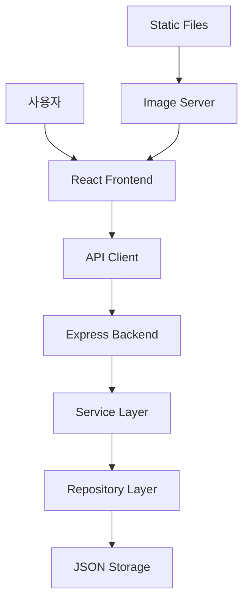

# 🛠️ 개발 가이드

배경화면 다운로드 웹사이트 프로젝트의 상세한 개발 가이드입니다.

## 📋 목차

- [프로젝트 개요](#프로젝트-개요)
- [개발 환경 설정](#개발-환경-설정)
- [아키텍처 이해](#아키텍처-이해)
- [개발 워크플로우](#개발-워크플로우)
- [코딩 컨벤션](#코딩-컨벤션)
- [테스팅 가이드](#테스팅-가이드)
- [디버깅 가이드](#디버깅-가이드)
- [성능 최적화](#성능-최적화)
- [배포 가이드](#배포-가이드)

## 🎯 프로젝트 개요

### 기술 스택

- **백엔드**: Express.js + TypeScript
- **프론트엔드**: React 18 + TypeScript + Vite
- **테스팅**: Jest + Vitest + Playwright + fast-check
- **모노레포**: npm workspaces
- **빌드 도구**: TypeScript Compiler + Vite

### 핵심 기능

1. **배경화면 탐색**: 테마별 배경화면 브라우징
2. **검색 기능**: 실시간 키워드 검색
3. **좋아요 시스템**: 개인화된 배경화면 관리
4. **다운로드**: 다중 해상도 이미지 다운로드
5. **반응형 UI**: 모든 디바이스 지원

## 🚀 개발 환경 설정

### 1. 시스템 요구사항

```bash
# Node.js 버전 확인
node --version  # >= 18.0.0

# npm 버전 확인
npm --version   # >= 9.0.0
```

### 2. 프로젝트 클론 및 설정

```bash
# 저장소 클론
git clone <repository-url>
cd wallpaper-website

# 자동 설정 실행
npm run setup
```

### 3. 개발 서버 실행

```bash
# 모든 서비스 동시 실행
npm run dev

# 개별 서비스 실행
npm run dev:backend    # 백엔드만
npm run dev:frontend   # 프론트엔드만
npm run dev:shared     # 공통 패키지 감시
```

### 4. IDE 설정

#### VS Code 권장 확장

```json
{
  "recommendations": [
    "ms-vscode.vscode-typescript-next",
    "bradlc.vscode-tailwindcss",
    "esbenp.prettier-vscode",
    "ms-playwright.playwright",
    "orta.vscode-jest"
  ]
}
```

#### VS Code 설정

```json
{
  "typescript.preferences.importModuleSpecifier": "relative",
  "editor.formatOnSave": true,
  "editor.codeActionsOnSave": {
    "source.fixAll.eslint": true
  }
}
```

## 🏗️ 아키텍처 이해

### 모노레포 구조

```
wallpaper-website/
├── packages/
│   ├── backend/           # Express API 서버
│   └── frontend/          # React 애플리케이션
├── shared/                # 공통 타입 및 유틸리티
├── scripts/               # 빌드 및 개발 스크립트
├── docs/                  # 문서
└── .kiro/specs/          # 프로젝트 명세서
```

### 데이터 플로우



### 백엔드 아키텍처

```
src/
├── routes/           # API 엔드포인트
├── services/         # 비즈니스 로직
├── repositories/     # 데이터 접근
├── middleware/       # 미들웨어
├── utils/           # 유틸리티
└── data/            # JSON 데이터
```

### 프론트엔드 아키텍처

```
src/
├── components/       # UI 컴포넌트
├── pages/           # 페이지 컴포넌트
├── api/             # API 클라이언트
├── hooks/           # 커스텀 훅
├── context/         # 상태 관리
└── utils/           # 유틸리티
```

## 🔄 개발 워크플로우

### 1. 기능 개발 프로세스

```bash
# 1. 새 브랜치 생성
git checkout -b feature/new-feature

# 2. 개발 서버 실행
npm run dev

# 3. 코드 작성 및 테스트
npm test

# 4. 빌드 확인
npm run build

# 5. 커밋 및 푸시
git add .
git commit -m "feat: add new feature"
git push origin feature/new-feature
```

### 2. 새로운 API 엔드포인트 추가

```typescript
// 1. 공통 타입 정의 (shared/src/types/)
export interface NewFeature {
  id: string;
  name: string;
  // ...
}

// 2. 백엔드 서비스 구현 (packages/backend/src/services/)
export class NewFeatureService {
  async getNewFeature(id: string): Promise<NewFeature> {
    // 비즈니스 로직
  }
}

// 3. 백엔드 라우터 구현 (packages/backend/src/routes/)
router.get('/new-feature/:id', async (req, res) => {
  const feature = await newFeatureService.getNewFeature(req.params.id);
  res.json({ success: true, data: feature });
});

// 4. 프론트엔드 API 클라이언트 (packages/frontend/src/api/)
export const getNewFeature = (id: string) => 
  apiClient.get(`/new-feature/${id}`);

// 5. 프론트엔드 컴포넌트에서 사용
const { data } = await getNewFeature(id);
```

### 3. 새로운 UI 컴포넌트 추가

```typescript
// 1. 컴포넌트 파일 생성
// packages/frontend/src/components/ui/NewComponent.tsx
interface NewComponentProps {
  title: string;
  onAction: () => void;
}

export const NewComponent: React.FC<NewComponentProps> = ({ title, onAction }) => {
  return (
    <div className="new-component">
      <h2>{title}</h2>
      <button onClick={onAction}>Action</button>
    </div>
  );
};

// 2. 스타일 파일 생성
// packages/frontend/src/components/ui/NewComponent.css
.new-component {
  padding: 1rem;
  border: 1px solid #ccc;
  border-radius: 8px;
}

// 3. 테스트 파일 생성
// packages/frontend/src/components/ui/NewComponent.test.tsx
import { render, screen, fireEvent } from '@testing-library/react';
import { NewComponent } from './NewComponent';

describe('NewComponent', () => {
  it('renders title correctly', () => {
    render(<NewComponent title="Test Title" onAction={() => {}} />);
    expect(screen.getByText('Test Title')).toBeInTheDocument();
  });
});

// 4. 인덱스 파일에 export 추가
// packages/frontend/src/components/ui/index.ts
export { NewComponent } from './NewComponent';
```

## 📝 코딩 컨벤션

### TypeScript 스타일

```typescript
// ✅ 좋은 예
interface WallpaperCardProps {
  wallpaper: Wallpaper;
  isLiked?: boolean;
  onLike?: (wallpaperId: string) => void;
}

export const WallpaperCard: React.FC<WallpaperCardProps> = ({
  wallpaper,
  isLiked = false,
  onLike,
}) => {
  const handleLike = useCallback(() => {
    onLike?.(wallpaper.id);
  }, [onLike, wallpaper.id]);

  return (
    <div className="wallpaper-card">
      {/* 컴포넌트 내용 */}
    </div>
  );
};

// ❌ 나쁜 예
export const WallpaperCard = (props: any) => {
  return <div>{/* 내용 */}</div>;
};
```

### 네이밍 컨벤션

```typescript
// 컴포넌트: PascalCase
export const WallpaperGrid = () => {};

// 함수: camelCase
const handleWallpaperClick = () => {};

// 상수: UPPER_SNAKE_CASE
const API_BASE_URL = 'http://localhost:3001';

// 타입/인터페이스: PascalCase
interface WallpaperData {}
type ThemeId = string;

// 파일명: kebab-case
// wallpaper-card.tsx
// user-preference-service.ts
```

### 폴더 구조 컨벤션

```
components/
├── ui/              # 재사용 가능한 UI 컴포넌트
├── layout/          # 레이아웃 컴포넌트
└── forms/           # 폼 관련 컴포넌트

pages/               # 페이지 컴포넌트
hooks/               # 커스텀 훅
utils/               # 유틸리티 함수
types/               # 타입 정의
constants/           # 상수 정의
```

## 🧪 테스팅 가이드

### 테스트 전략

1. **단위 테스트**: 개별 함수/컴포넌트 테스트
2. **통합 테스트**: API 엔드포인트 테스트
3. **E2E 테스트**: 사용자 플로우 테스트
4. **속성 기반 테스트**: 정확성 속성 검증

### 단위 테스트 작성

```typescript
// 백엔드 서비스 테스트
describe('WallpaperService', () => {
  let service: WallpaperService;

  beforeEach(() => {
    service = new WallpaperService();
  });

  it('should return wallpapers by theme', async () => {
    const wallpapers = await service.getWallpapersByTheme('nature');
    
    expect(wallpapers).toBeDefined();
    expect(wallpapers.every(w => w.themeId === 'nature')).toBe(true);
  });
});

// 프론트엔드 컴포넌트 테스트
describe('SearchBar', () => {
  it('calls onChange when input value changes', () => {
    const mockOnChange = jest.fn();
    render(<SearchBar value="" onChange={mockOnChange} onClear={() => {}} />);
    
    const input = screen.getByRole('textbox');
    fireEvent.change(input, { target: { value: 'nature' } });
    
    expect(mockOnChange).toHaveBeenCalledWith('nature');
  });
});
```

### 속성 기반 테스트 작성

```typescript
import fc from 'fast-check';

describe('Wallpaper validation properties', () => {
  it('Property 1: Theme filtering consistency', () => {
    fc.assert(fc.property(
      fc.array(fc.record({
        id: fc.string(),
        themeId: fc.constantFrom('nature', 'space', 'city'),
        title: fc.string(),
        // ... 기타 필드
      })),
      fc.constantFrom('nature', 'space', 'city'),
      (wallpapers, selectedTheme) => {
        const filtered = wallpapers.filter(w => w.themeId === selectedTheme);
        return filtered.every(w => w.themeId === selectedTheme);
      }
    ));
  });
});
```

### E2E 테스트 작성

```typescript
// packages/frontend/src/e2e/wallpaper-flow.spec.ts
import { test, expect } from '@playwright/test';

test('wallpaper browsing and download flow', async ({ page }) => {
  await page.goto('/');
  
  // 테마 선택
  await page.click('[data-testid="theme-nature"]');
  await expect(page.locator('[data-testid="wallpaper-grid"]')).toBeVisible();
  
  // 배경화면 클릭
  await page.click('[data-testid="wallpaper-card"]:first-child');
  await expect(page.locator('[data-testid="wallpaper-detail"]')).toBeVisible();
  
  // 다운로드 모달 열기
  await page.click('[data-testid="download-button"]');
  await expect(page.locator('[data-testid="download-modal"]')).toBeVisible();
  
  // 해상도 선택
  await page.click('[data-testid="resolution-1920x1080"]');
  
  // 다운로드 시작 확인
  const downloadPromise = page.waitForEvent('download');
  await page.click('[data-testid="confirm-download"]');
  const download = await downloadPromise;
  
  expect(download.suggestedFilename()).toMatch(/\.(jpg|png|webp)$/);
});
```

## 🐛 디버깅 가이드

### 백엔드 디버깅

```typescript
// 로깅 활용
import { logger } from '../utils/logger';

export class WallpaperService {
  async getWallpapers(): Promise<Wallpaper[]> {
    logger.info('Getting wallpapers');
    
    try {
      const wallpapers = await this.repository.findAll();
      logger.info(`Found ${wallpapers.length} wallpapers`);
      return wallpapers;
    } catch (error) {
      logger.error('Error getting wallpapers:', error);
      throw error;
    }
  }
}

// VS Code 디버깅 설정 (.vscode/launch.json)
{
  "version": "0.2.0",
  "configurations": [
    {
      "name": "Debug Backend",
      "type": "node",
      "request": "launch",
      "program": "${workspaceFolder}/packages/backend/src/index.ts",
      "outFiles": ["${workspaceFolder}/packages/backend/dist/**/*.js"],
      "runtimeArgs": ["-r", "ts-node/register"],
      "env": {
        "NODE_ENV": "development"
      }
    }
  ]
}
```

### 프론트엔드 디버깅

```typescript
// React DevTools 활용
const WallpaperCard = ({ wallpaper }) => {
  // 디버깅용 로그
  console.log('WallpaperCard render:', wallpaper);
  
  // 조건부 디버깅
  if (process.env.NODE_ENV === 'development') {
    console.log('Debug info:', { wallpaper });
  }
  
  return <div>{/* 컴포넌트 내용 */}</div>;
};

// 브라우저 디버깅
const handleClick = () => {
  debugger; // 브레이크포인트 설정
  // 로직 실행
};
```

### 네트워크 디버깅

```typescript
// API 클라이언트 인터셉터
apiClient.interceptors.request.use(
  (config) => {
    console.log('API Request:', config);
    return config;
  },
  (error) => {
    console.error('API Request Error:', error);
    return Promise.reject(error);
  }
);

apiClient.interceptors.response.use(
  (response) => {
    console.log('API Response:', response);
    return response;
  },
  (error) => {
    console.error('API Response Error:', error);
    return Promise.reject(error);
  }
);
```

## ⚡ 성능 최적화

### 백엔드 최적화

```typescript
// 응답 캐싱
import NodeCache from 'node-cache';
const cache = new NodeCache({ stdTTL: 600 }); // 10분 캐시

export class WallpaperService {
  async getWallpapers(): Promise<Wallpaper[]> {
    const cacheKey = 'all-wallpapers';
    const cached = cache.get<Wallpaper[]>(cacheKey);
    
    if (cached) {
      return cached;
    }
    
    const wallpapers = await this.repository.findAll();
    cache.set(cacheKey, wallpapers);
    return wallpapers;
  }
}

// 이미지 최적화
import sharp from 'sharp';

export const generateThumbnail = async (inputPath: string, outputPath: string) => {
  await sharp(inputPath)
    .resize(300, 200, { fit: 'cover' })
    .jpeg({ quality: 80 })
    .toFile(outputPath);
};
```

### 프론트엔드 최적화

```typescript
// 컴포넌트 메모이제이션
const WallpaperCard = memo<WallpaperCardProps>(({ wallpaper, onLike }) => {
  const handleLike = useCallback(() => {
    onLike?.(wallpaper.id);
  }, [onLike, wallpaper.id]);
  
  return <div>{/* 컴포넌트 내용 */}</div>;
});

// 이미지 지연 로딩
const LazyImage = ({ src, alt, ...props }) => {
  const [isLoaded, setIsLoaded] = useState(false);
  const [isInView, setIsInView] = useState(false);
  const imgRef = useRef<HTMLImageElement>(null);
  
  useEffect(() => {
    const observer = new IntersectionObserver(
      ([entry]) => {
        if (entry.isIntersecting) {
          setIsInView(true);
          observer.disconnect();
        }
      },
      { threshold: 0.1 }
    );
    
    if (imgRef.current) {
      observer.observe(imgRef.current);
    }
    
    return () => observer.disconnect();
  }, []);
  
  return (
    <div ref={imgRef}>
      {isInView && (
         setIsLoaded(true)}
          style={{ opacity: isLoaded ? 1 : 0 }}
          {...props}
        />
      )}
    </div>
  );
};

// 가상화된 리스트 (대량 데이터용)
import { FixedSizeList as List } from 'react-window';

const VirtualizedWallpaperGrid = ({ wallpapers }) => {
  const Row = ({ index, style }) => (
    <div style={style}>
      <WallpaperCard wallpaper={wallpapers[index]} />
    </div>
  );
  
  return (
    <List
      height={600}
      itemCount={wallpapers.length}
      itemSize={200}
    >
      {Row}
    </List>
  );
};
```

## 🚀 배포 가이드

### 프로덕션 빌드

```bash
# 전체 프로덕션 빌드
npm run build:prod

# 개별 패키지 빌드
npm run build:backend
npm run build:frontend
```

### 환경 변수 설정

```bash
# 백엔드 환경 변수 (.env)
NODE_ENV=production
PORT=3001
UPLOAD_DIR=./uploads
LOG_LEVEL=info

# 프론트엔드 환경 변수 (.env)
VITE_API_BASE_URL=https://api.example.com
VITE_APP_TITLE=배경화면 다운로드 사이트
```

### Docker 배포

```dockerfile
# Dockerfile
FROM node:18-alpine

WORKDIR /app

# 의존성 설치
COPY package*.json ./
COPY packages/backend/package*.json ./packages/backend/
COPY packages/frontend/package*.json ./packages/frontend/
COPY shared/package*.json ./shared/

RUN npm ci --only=production

# 소스 코드 복사
COPY . .

# 빌드
RUN npm run build:prod

# 포트 노출
EXPOSE 3001

# 실행
CMD ["npm", "run", "start:prod"]
```

### 성능 모니터링

```typescript
// 백엔드 성능 모니터링
import { performance } from 'perf_hooks';

const performanceMiddleware = (req, res, next) => {
  const start = performance.now();
  
  res.on('finish', () => {
    const duration = performance.now() - start;
    console.log(`${req.method} ${req.path} - ${duration.toFixed(2)}ms`);
  });
  
  next();
};

// 프론트엔드 성능 모니터링
const usePerformanceMonitor = () => {
  useEffect(() => {
    const observer = new PerformanceObserver((list) => {
      list.getEntries().forEach((entry) => {
        console.log(`${entry.name}: ${entry.duration}ms`);
      });
    });
    
    observer.observe({ entryTypes: ['navigation', 'resource'] });
    
    return () => observer.disconnect();
  }, []);
};
```

## 🔧 문제 해결

### 자주 발생하는 문제들

#### 1. 포트 충돌

```bash
# 포트 사용 확인
netstat -ano | findstr :3001
netstat -ano | findstr :5173

# 프로세스 종료 (Windows)
taskkill /PID <PID> /F

# 환경 변수로 포트 변경
PORT=3002 npm run dev:backend
```

#### 2. 의존성 충돌

```bash
# 의존성 트리 확인
npm ls

# 중복 의존성 제거
npm dedupe

# 전체 재설치
npm run clean:all
npm run setup
```

#### 3. 타입 오류

```bash
# 타입 체크
npx tsc --noEmit

# 공통 패키지 재빌드
npm run build --workspace=shared
```

#### 4. 테스트 실패

```bash
# 테스트 캐시 정리
npm test -- --clearCache

# 특정 테스트 실행
npm test -- --testNamePattern="specific test"

# 디버그 모드로 테스트
npm test -- --runInBand --detectOpenHandles
```

## 📚 추가 리소스

- [React 공식 문서](https://react.dev/)
- [Express.js 가이드](https://expressjs.com/)
- [TypeScript 핸드북](https://www.typescriptlang.org/docs/)
- [Jest 테스팅 가이드](https://jestjs.io/docs/getting-started)
- [Playwright E2E 테스팅](https://playwright.dev/)
- [fast-check 속성 기반 테스팅](https://fast-check.dev/)

---

이 가이드는 지속적으로 업데이트됩니다. 질문이나 개선 사항이 있으면 GitHub Issues를 통해 문의해 주세요.